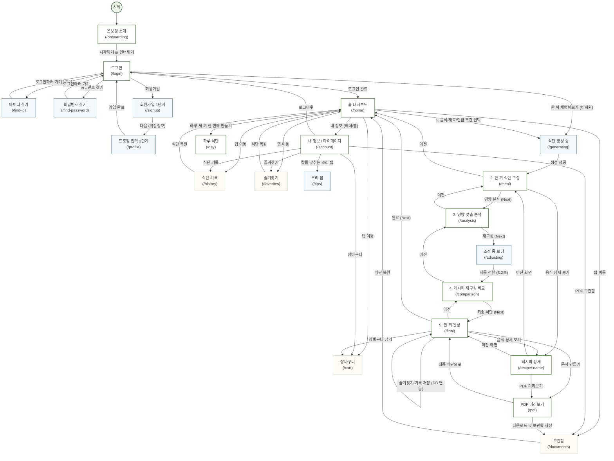

# KOOK 맞춤형 식단 서비스 — 전체 화면 전환 구성도 (Screen Transition Map)

본 문서는 **KOOK (투석 환자용 맞춤형 한 끼 식단 서비스)**의 전체 화면 흐름과 라우팅 구조, 그리고 각 화면별 상태 변화와 전환 규칙을 상세히 정리한 개발 및 설계 가이드라인입니다.

---

## 1. 전체 화면 전환 흐름도 (Mermaid Diagram)

---

## 2. 세부 화면 전환 설계서 (Detailed Route Specifications)

### 2.1 진입 및 사용자 인증 흐름 (Auth Flow)

| 경로 (Route) | 화면명 | 주요 기능 및 액션 | 대상 전환 경로 | 비고 |
| :--- | :--- | :--- | :--- | :--- |
| `/` | 루트 분기 | 진입 시 `/onboarding`으로 리다이렉트 | `/onboarding` | 항상 온보딩 소개부터 시작하도록 분기 처리 |
| `/onboarding` | 온보딩 소개 | 서비스 주요 기능 6단계 슬라이드 뷰어 | `/login` (시작하기 / 건너뛰기 클릭 시) | 노인 친화적 일러스트 및 컴포넌트 미리보기 제공 |
| `/login` | 로그인 | 아이디/비밀번호 입력 및 인증 처리 | `/home` (성공 시) `/find-id` `/find-password` `/signup` `/generating` (체험하기) | "한 끼 체험해보기" 클릭 시 로그인 없이 비회원 모드로 생성 진행 |
| `/find-id` | 아이디 찾기 | 가입 시 입력한 이름 + 생년월일 기반 계정 검색 | `/login` | 문자/이메일 발송 없이 DB 일치 조건 확인 후 바로 화면 노출 |
| `/find-password` | 비밀번호 찾기 | 이름 + 생년월일 + 아이디 본인 확인 후 즉시 재설정 | `/login` | 성공 시 타 세션 강제 만료 처리 |
| `/signup` | 회원가입 1단계 | 계정 정보 생성 (이름, 아이디, 비밀번호, 약관 동의) | `/profile` (성공 시) `/login` | 아이디 중복 및 형식, 비밀번호 실시간 유효성 체크 안내 |
| `/profile` | 프로필 입력 2단계 | 신체 정보 등록 (성공 시 가입 완료 및 자동 로그인 연계) | `/home` (완료 시) `/login` (뒤로가기) | 성별, 생년월일(만 나이 계산), 신장, 체중, 투석유형(HD/PD) |

---

### 2.2 메인 및 개인 기능 흐름 (Dashboard & Library Flow)

| 경로 (Route) | 화면명 | 주요 기능 및 액션 | 대상 전환 경로 | 비고 |
| :--- | :--- | :--- | :--- | :--- |
| `/home` | 홈 대시보드 | 식단 생성 조건 지정 및 생성 요청 | `/generating` `/day` `/account` `/history` `/favorites` `/documents` `/cart` | 음식명 검색 / 사용 재료 기반 메뉴 조회 / 랜덤 추천 3개 탭 제공 |
| `/account` | 내 정보 | 사용자 신체 프로필 통계 확인 및 앱 설정 메뉴 | `/profile` (수정 시) `/tips` `/history` `/favorites` `/documents` `/cart` `/login` (로그아웃) | 진입 시 백엔드 `/me` 호출하여 최신 데이터로 동기화 |
| `/tips` | 조리 팁 가이드 | 칼륨을 낮추기 위한 채소 손질 및 조리법 안내 | `/account` | 단단한 채소, 부드러운 채소 분류 가이드 제공 |
| `/history` | 식단 기록 | 과거 생성 및 저장 완료한 식단 목록 조회 | `/home` (식단 복원 시) | 복원 선택 시 해당 시점의 `apiResult`가 메모리에 복구됨 |
| `/favorites` | 즐겨찾기 | 보관된 즐겨찾기 식단 카드 조회 및 복원/삭제 | `/home` (식단 복원 시) | 백엔드 `/me/favorites`와 실시간 DB 동기화 |
| `/documents` | PDF 보관함 | 저장 완료한 PDF 리스트 확인 및 복원 | `/home` (식단 복원 시) | 백엔드 `/me/documents` 연동 |
| `/cart` | 장바구니 | 식단 재료 준비 체크리스트 및 구매 관리 | `/home` (식단 만들기) | 완성 식단에서 담아온 재료명과 소수점 2자리 단위 g 표시 |

---

### 2.3 AI 맞춤 식단 생성 및 검증 흐름 (Generation Flow)

| 경로 (Route) | 단계 (Step) | 화면명 | 주요 기능 및 액션 | 대상 전환 경로 | 비고 |
| :--- | :--- | :--- | :--- | :--- |
| `/generating` | **Step 1** | 식단 생성 로딩 | 백엔드 AI 엔진 호출 및 조건 검색 과정 트래킹 | `/meal` (성공 시) | 타임아웃 60초 확대 적용 및 단계별 상세 안내 메시지 제공 |
| `/meal` | **Step 2** | 한 끼 식단 구성 | AI가 조합한 밥·국·반찬 식단 리스트 노출 | `/home` (이전) `/analysis` (다음) `/recipe/:name` | 밥, 국, 반찬 3가지 등 총 5개 메뉴 리스트 한 줄 카드로 배치 |
| `/analysis` | **Step 3** | 영양 맞춤 분석 | 개인 영양 목표치 대비 과다/미달 판정 시각화 | `/meal` (이전) `/adjusting` (다음) | 5대 영양소(열량, 단백질, 인, 칼륨, 나트륨) 도넛 % 링 및 3구간 막대 게이지 표시 |
| `/adjusting` | **Step 4** | 조정 중 로딩 | 영양 기준 만족을 위한 조미량 및 재료 변경 계산 | `/comparison` (자동 전환) | 3.2초 대기 후 자동으로 다음 화면 전환 |
| `/comparison` | **Step 4** | 레시피 재구성 비교 | 조정 전후 재료 양 및 대체 식재료 비교 노출 | `/analysis` (이전) `/final` (다음) | 변경사항(Portion control, Swap, Removal) 순차 카드 등장 애니메이션 적용 |
| `/final` | **Step 5** | 한 끼 완성 | 최종 조율 완료된 안심 식단과 최종 영양 성분 | `/comparison` (이전) `/home` (완료) `/recipe/:name` `/cart` (담기) `/pdf` (문서화) | 기록 저장, 즐겨찾기 추가, 장바구니 담기, PDF 발급 연계 |
| `/day` | - | 하루 식단 생성 | 하루(아침·점심·저녁) 식단 동시 생성 결과 및 누적 영양 | `/home` `/recipe/:name` | 끼니마다 앞서 섭취한 영양을 반영하여 이어서 생성하는 고급 플로우 |
| `/recipe/:name` | - | 레시피 상세 | 선택 음식 조리과정 및 AI 추천 조리법 편집 내용 | `/pdf` 뒤로가기 (`/meal` or `/final`) | **🔊 조리과정 음성 재생 (TTS)** 버튼 탑재. AI 대체 재료에 따른 조리 변경점 별도 강조 |
| `/pdf` | - | PDF 미리보기 | A4 서식의 환자용 인쇄물 레이아웃 제공 | `/final` 파일 다운로드 (완료 후 로컬 저장) | 브라우저 기반 `html2canvas` & `jspdf` 빌드 및 DB 보관함 자동 연동 |

---

## 3. 핵심 사용자 경험(UX) 및 화면 네비게이션 규칙

1. **상태 기반 화면 이탈 방지 및 되돌아가기 (`FlowFooter` 연계)**
   - 식단 생성의 2단계(`한 끼 식단 구성`)부터 5단계(`한 끼 완성`)까지 하단 네비게이션 영역에 **`‹ 이전`** 버튼을 제공하여, 사용자가 언제든지 이전 단계의 데이터와 구성 결과를 재검토할 수 있게 합니다.

2. **비회원(체험) 모드 제약 사항 및 라우팅 분기**
   - 로그인 화면의 `한 끼 체험해보기`를 통해 진입한 사용자는 모든 생성 플로우(`Generating` → `Meal` → `Analysis` → `Adjusting` → `Comparison` → `Final` → `Recipe` → `PDF`)를 온전히 이용할 수 있습니다.
   - 단, 5단계 완성 화면(`Final`)에서 **즐겨찾기**, **기록 저장**, **PDF 보관함** 저장 클릭 시 `requireUser` 헬퍼가 동작하여 비회원 상태임을 감지하고 자동으로 **`/login`** 화면으로 전환하며 회원가입/로그인을 유도합니다.

3. **자동화 화면 연계 및 딜레이 트랜지션**
   - 사용자가 수동으로 개입할 필요가 없는 연산 구간인 `Generating` 및 `Adjusting` 단계는 애니메이션을 통해 시스템 상태를 직관적으로 전달하며, 계산이 끝나는 즉시 다음 타겟 라우트로 자연스럽게 라우팅 처리가 이루어집니다.
